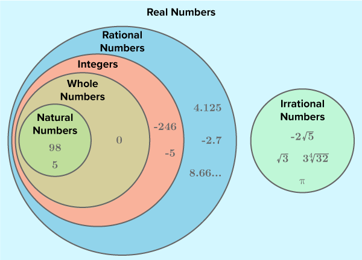

# Group Theory
> [Google Doc Instructions](https://docs.google.com/document/d/11YEtkYBMcMLUcyIWrua0tT1xtqI3rzT3Najs3Ntpp0U/edit)
## Part 1

### Introduction to Jupyter notebook

> Standard introduction similar to the one found in the Gecko Lesson

### Number systems (A focus on rational numbers)

How many numbers are in the universe? 1, 2, 3… 
Well 1, 1.5, 2, 2.5 oh. Wait there’s 0, 1, 2, … There are too many to count! 
Whole numbers, fractions, square roots, pi, the list goes on. 
Different numbers have different properties and we can use them in fun and productive ways!



Each number system has its own symbol!

ℕ represents the Natural Numbers
	As you can see from the diagram, the Natural numbers include all positive numbers EXCLUDING 0. 

Give an example of a Natural Number

`YOUR ANSWER HERE`


ℤ represents the Integers
	The Integers include the Natural numbers INCLUDING 0 and the negative numbers.

Give a new example of an Integer

`YOUR ANSWER HERE`


ℚ represents the Rational Numbers
	Rational numbers include the Integers and any number that can be written as a fraction. Formally,
pq where p, q ∈ ℤ [this means p and q are arbitrary (random) integers]

Give a new example of a Rational Number

`YOUR ANSWER HERE`


ℝ represents the Real Numbers
	The real numbers include the rational numbers AND irrational numbers. Irrational numbers are those that cannot take the form of a fraction. This includes 𝛑 and roots like 5.

Give a new example of a Real Number

`YOUR ANSWER HERE`


For this lesson, we will focus on the Rational Numbers! 


### What is a Group?

A group is a set (of numbers), together with a binary operation (+ or *) with the following properties:

> Note: A binary operation means that the operation is completed on two numbers and a third is created 
(Ex. $2+2 = 4$, the two numbers taken are 2 and 2, they are added and the output of the operation is $4$)

- Associativity: $(a * b) * c = a * (b * c)$ where $a, b, c$ represent numbers
    - Existence of identity: For adding, the existence identity is 0 where: $0 + a = a$
    - For multiplying, the existence identity is 1 where: $1 * a = a$
    - This essentially means that the element exists

- Existence of inverses: the existence of inverses allows us to subtract and divide
    - Given a number $a$, there is some number $b$ where 
        - For adding: $a + b = 0$
        - For multiplying: $a * b = 1$
- Commutativity: $a * b = b * a$
    - These groups are called *Abelian*

The groups we will be working with are the rational numbers and both operations. However, with multiplication, we cannot include the number 0. These are Abelian and have all four properties.

If $a = 0$, $\frac{b}{0}$ is an impossible number for any number $b$. We refer to this as *undefined*. Why might any number divided by $0$ be undefined. 
> (Hint: Think about the number 6 being divided into 0, there are no 6’s in 0. Now think about the number 0 being divided into 6.) 

Give it your best shot!

`YOUR ANSWER HERE`


Basically, the way we can think about it, is that $0$ takes up no space in a number, so we can add an infinite amount of $0$’s into $6$, or any number! This is a simplified explanation of why $\frac{b}{0}$ is undefined.

#### (ℚ, +) Adding!

If we have the number $10$, what is its inverse and how do we show its existence?

Assign our number to a variable like $a$. Use the Existence of Identity and Inverses to assign other variables depicting these expressions. We’ll provide an example of setting a variable name this time, but afterwards, it’s all you! 

```python
a = 
a_add_identity = 
a_add_inverse = 
```

#### (ℚ\{0}, x) Multiplying!

The above is formal notation, but simply means we are using the rational numbers without $0$. We will use your variable, $a$, again! As you already assigned it before, the notebook has stored the information that, $a$ always equals $10$.

```python
a_multi_identity = 
a_mult_inverse = 
```

### Manipulating Equations Using Group Properties

Recently, you have worked with equations and variables. We know variables are placeholders for values with a significant and specific meaning. We know we can use variables in equations to find important information based on constraints.

Equations can start to get difficult to solve for, and it is important to develop solid techniques for manipulating. We can use the properties of groups to conduct arithmetic required to manipulate equations.

When looking at moving equations around, we have to maintain symmetry. If we were to operate on only one side of an equation without changing the other, would we still have a valid equation? Explain your reasoning.

`YOUR ANSWER HERE`

If we are not adhering to the Existence of Identity (this means only adding 0 or multiplying by 1) we now have a completely different equation than we started with. However, if we add the same number to both sides, or multiply a number to both sides, the equation remains equal!

> (Modules: I would love to have a simple visual table where students can visualize the symmetry and group like this: [Symmetry](https://docs.google.com/document/d/19FlyKg-465Ntgl_cA-UWETe75IlhaKini8WKfkZjC2c/edit))


## Part 2 

### Ballin’ on a Budget!

> (Modules: Students will need to load their specific table from the dataset at this point. An introduction to plotly might be necessary for this portion of the lesson. This activity is meant to be completed in a group where each student submits their own notebook. [Inspiration](https://curriculum.illustrativemathematics.org/HS/teachers/1/2/1/preparation.html))

Now that we can manipulate equations and understand arithmetic conventions, we can use these skills to problem solve in real life situations. The typical application of these we see is in situations dealing with money. 

<code style="color:red; font-size:20px">FINISH THIS PART</code></br>
<code style="color:orange; font-size:20px">FINISH THIS PART</code></br>
<code style="color:yellow; font-size:20px">FINISH THIS PART</code></br>
<code style="color:green; font-size:20px">FINISH THIS PART</code></br>
<code style="color:blue; font-size:20px">FINISH THIS PART</code></br>
<code style="color:indigo; font-size:20px">FINISH THIS PART</code></br>
<code style="color:violet; font-size:20px">FINISH THIS PART</code></br>

Let’s say your entire freshman class wins a pizza party. …. Need to finish spiel

<code style="color:red; font-size:20px">FINISH THIS PART</code></br>
<code style="color:orange; font-size:20px">FINISH THIS PART</code></br>
<code style="color:yellow; font-size:20px">FINISH THIS PART</code></br>
<code style="color:green; font-size:20px">FINISH THIS PART</code></br>
<code style="color:blue; font-size:20px">FINISH THIS PART</code></br>
<code style="color:indigo; font-size:20px">FINISH THIS PART</code></br>
<code style="color:violet; font-size:20px">FINISH THIS PART</code></br>

The school does not have unlimited funds though, and we need to stay within a budget while ensuring everyone is fed! We can describe this using equations. Here are some of our constraints:

- Class size: 500 students
- Our total cost cannot exceed $3000
- Each person will eat pizza and take a drink

Now it’s your turn to represent this is an equation using [this dataset](https://www.kaggle.com/datasets/timmofeyy/-pizza-prices-menu-in-13-different-pizzerias) for prices from 13 pizza places. We have to be reasonable though. Describe how you may go about determining how much this pizza party will cost while keeping it within the budget.

`Your Answer here`


Maybe you mentioned the number of slices each student gets based on how expensive the pizza was, or maybe that you wanted to include a side dish to mix things up! It’s time to represent this in your equation. Choose the pizza place you will be buying from in the dataset. You may have to go to their website to find specific information like slices of pizza per box.

```python
Dataset = 
```

> (Modules: I want students to be able to type out their equation at this point so they can manipulate it and solve by hand.)


Type out your equation indicating what each variable means. There should be at least one equation and one inequality that will be graphed later. (Hint: What are our constraints? What are we trying to find?)

$ \text{Enter your equation here, replacing everything inside the dollar signs}$ 

`Explaination here`


Whatever your equation was, it probably took a form like this:

$p_1 \cdot x + p_2 \cdot y = t \ ; \ t < 3000$

where $p_1$ and $p_2$ relate to the price of pizza and drinks and $x$ and $y$ represent the number of boxes of pizza and drinks

$x = 500 \cdot ns$

where $n$ is the number of slices and $s$ is the number slices per box

$y = 500 \cdot l$

where $l$ is the number of servings per $2$ liter bottle of soda

	
Using these equations, we can now use our arithmetic principles we learned earlier to determine whether or not the pizza prices we chose work with our budget! We will do this computationally first.

`Code answer here`


Did your choices satisfy the constraint? If they did not, rewrite your equations using Papa John’s prices and pizza sizes. Rewrite your equation here if necessary:


`Quations here`


With the amount of freedom we have to choose what we can purchase, it is nice to be able to visualize all of our options! We can do this through graphing equations.

We can color graphs using plotly to distinguish between different equations.


` Insert Visualization here`


> (Modules: Is there a way to include the coordinate of intersection when graphing?)
Your graphs look great! What do you notice about where the graphs intersect? 


Yes! Where the graphs intersect gives us the solution for $x$ and $y$. This is represented by Cartesian coordinates: $(x, y)$ that shows the distance from the origin at $(0, 0)$. When $x = 0$ and $y = 0$.

Maybe you have a lot of room in your budget to spend more! Maybe you want to get a fun side like wings or breadsticks to change things up. How could we find how many sides we can get that stays in our budget? That’s right, another equation!

We have some limitations working within Jupyter as we only work with $x$ and $y$ when graphing.

> (Modules: I just assumed this? I know matplotlib only takes in specific variables and 2 at most, but maybe plotly is different, or I’m wrong in general haha!)


You probably developed a new equation (or multiple) that relates to how many students can enjoy each side and the prices. In order to graph this, let’s rearrange our equations and replace p1x and p2y with the number of slices or drinks and prices we already found. 

For example, if I were to choose a 50-50 mix of large pepperoni and cheese pizzas from Domino’s with 2 slices of pizza per student and a 50-50 mix of Coca-Cola and Sprite 2-Liters then my equation to find the number of sides would look like this:

$$x = \frac{500 \cdot 2}{8}$$ 				
$$y = \frac{500}{8}$$					
$$m = \frac{500}{d}$$	

where $d$ represents the number of students that can enjoy a single order of the side


$$(15.99 \cdot 125) + (2.99 \cdot 63) + p_3 \cdot m \leq 3000$$
$$2187.12 + p_3 \cdot m \leq 3000 $$
$$(2187.12 + (-2187.12))+ p_3 \cdot m \leq (3000+(-2187.12))$$
$$ 0+p_3 \cdot m \leq 812.88$$
$$p_3 \cdot m \leq 812.88$$
$$p \cdot 3 \leq 812.88m$$

where $m$ represents the number of sides and $p_3$ represents the price

If you need to edit your equations, you can edit them in the previous cell. We will also be graphing these equations to determine the range of the number of sides we can get for the entire freshman class to enjoy!

`Cell here`

List the side and the quantity you chose and describe how you know this is possible. Explain your reasoning!

`Your answer here`

Let’s create a table of the possible sides we could have chosen and the possible totals.
> (Modules: If there is a way we can give them a format that they can easily fill in while still personalizing, that would be awesome! Here’s the format I was thinking of.)

Example format
|Possible Sides | Pizza $ * # of boxes | Drink $ * # of drinks | Side $ * quantity|
|---------------|----------------------|-----------------------|------------------|
|“breadsticks”  | same                 | same                  | 14.99*20         |
|“wings”        | same                 | same                  | 15.50*20         |
|“salad”        | same                 | same                  | 2.99*250         |


Great work! This was just one example of solving a system of equations through graphing and actual computation. What methods did you use to solve these systems of equations?

`Your answer here`

What other situations might we use a system of equations where we must consider constraints and have multiple factors to consider?

`Your answer here`

You may have mentioned money building interest, building projects, and more! 
